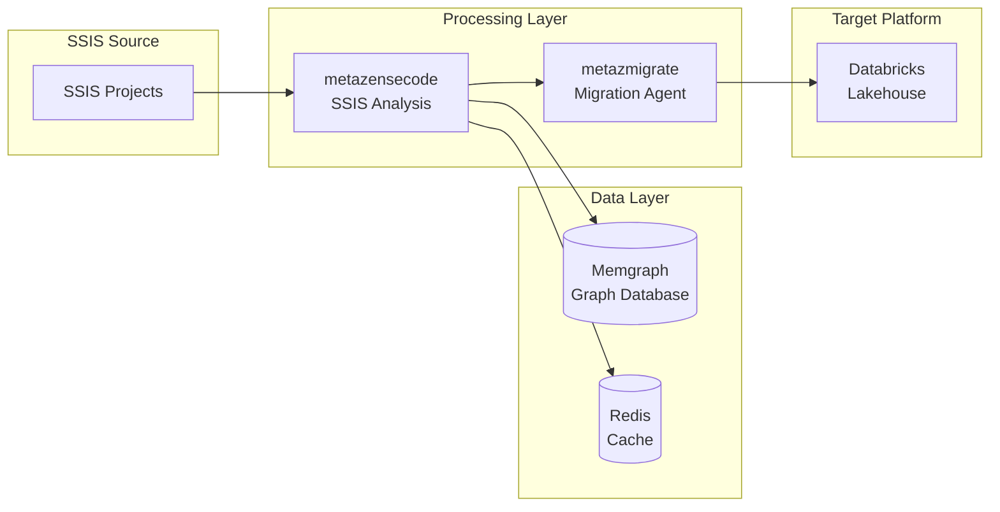

# SSIS to Databricks Migration MVP - Product Requirements Document

## 🎯 Executive Summary

This MVP delivers a **complete SSIS to Databricks migration pipeline** using **metazensecode** for SSIS analysis and **metazmigrate** for intelligent migration. The system ingests SSIS packages, creates a Memgraph-based graph representation, and generates production-ready Databricks artifacts.

## 🏗️ System Architecture



## 📋 MVP Scope

### ✅ Included Features
- **SSIS Package Ingestion**: Complete .dtsx file parsing
- **Graph Representation**: Memgraph-based SSIS graph
- **Migration Analysis**: Complexity scoring and readiness assessment
- **PySpark Generation**: Production-ready Databricks notebooks
- **Validation**: Migration correctness verification

### ❌ Out of Scope
- Multi-source ETL support (Informatica, Talend, etc.)
- Multi-target platforms (Snowflake, Synapse, etc.)
- Advanced optimization algorithms
- Enterprise features (RBAC, multi-tenant, etc.)

## 🎯 Use Cases

### Primary Use Case
**Data Engineer** wants to migrate SSIS data warehouse to Databricks:
1. **Ingest** SSIS project into system
2. **Analyze** complexity and migration readiness
3. **Generate** PySpark notebooks and configurations
4. **Deploy** to Databricks with validation

### Secondary Use Cases
- **Assessment**: Evaluate migration complexity before committing
- **Learning**: Understand SSIS patterns and Databricks equivalents
- **Validation**: Verify migration correctness

## 🏗️ Technical Architecture

### **metazensecode Components**
- **SSISLoader**: Ingests .dtsx, .conmgr, .params files
- **SSISParser**: Extracts metadata and relationships
- **GraphConstructor**: Builds Memgraph graph
- **MemgraphClient**: Manages graph storage and queries

### **metazmigrate Components**
- **SSISDiscoveryTool**: Queries Memgraph for packages
- **SSISAnalysisTool**: Calculates complexity scores
- **SSISMigrationTool**: Generates PySpark code
- **DatabricksJobGenerator**: Creates Databricks configurations

### **Integration Layer**
- **ContextAdapter**: Translates SSIS → LLM context
- **ToolRegistry**: Manages tool discovery and loading
- **ValidationEngine**: Ensures migration correctness

## 📊 Data Model

### **SSIS Entities in Memgraph**
```cypher
// Packages
(:Package {id, name, description, complexity_score})

// Connections
(:Connection {id, name, type, connection_string})

// Tasks
(:Task {id, name, type, properties})

// Relationships
(:Package)-[:USES]->(:Connection)
(:Package)-[:CONTAINS]->(:Task)
(:Task)-[:DEPENDS_ON]->(:Task)
```

## 🎯 Success Criteria

### **Functional Requirements**
- [ ] **100% SSIS package ingestion** from .dtsx files
- [ ] **Complete graph representation** in Memgraph
- [ ] **Accurate complexity scoring** (1-10 scale)
- [ ] **Valid PySpark generation** for all SSIS patterns
- [ ] **Successful Databricks deployment** and execution

### **Performance Requirements**
- [ ] **< 30 seconds** for SSIS ingestion (100 packages)
- [ ] **< 5 seconds** for graph queries
- [ ] **< 60 seconds** for migration generation
- [ ] **95% accuracy** in migration correctness

### **Quality Requirements**
- [ ] **Zero data loss** during migration
- [ ] **Complete transformation mapping**
- [ ] **Proper error handling** and logging
- [ ] **Comprehensive documentation**

## 🚀 Implementation Phases

### **Phase 1: Foundation (Week 1)**
- **Setup**: Memgraph Docker configuration
- **Ingestion**: Complete SSIS file parsing
- **Graph**: Memgraph schema and data loading

### **Phase 2: Tools (Week 2)**
- **Discovery**: SSIS package queries
- **Analysis**: Complexity scoring
- **Migration**: PySpark generation

### **Phase 3: Integration (Week 3)**
- **Agent**: metazmigrate tool integration
- **Validation**: Migration correctness
- **Testing**: End-to-end validation

### **Phase 4: Polish (Week 4)**
- **Documentation**: Complete guides
- **Examples**: Sample migrations
- **Deployment**: Docker/Kubernetes setup

## 📁 File Structure

```
ssis-databricks-migration/
├── metazensecode/
│   ├── sdk/graph/memgraph_client.py
│   ├── sdk/ingestion/ssis/
│   └── cli/commands.py
├── metazmigrate/
│   ├── tools/migration/ssis/
│   ├── tools/platforms/databricks/
│   └── integration/context_adapter.py
├── examples/
│   ├── ssis_advworks/
│   └── ssis_northwind/
├── tests/
│   ├── test_ssis_ingestion.py
│   └── test_databricks_migration.py
└── deployment/
    ├── docker-compose.yml
    └── kubernetes/
```

## 🔧 Technical Requirements

### **Dependencies**
- **Python 3.12+**
- **Memgraph 2.11+**
- **Redis 7.0+**
- **Docker & Docker Compose**

### **Environment Variables**
```bash
MEMGRAPH_HOST=localhost
MEMGRAPH_PORT=7687
REDIS_HOST=localhost
REDIS_PORT=6379
```

## 🎯 Testing Strategy

### **Test Cases**
1. **SSIS Ingestion**: Complete .dtsx file parsing
2. **Graph Queries**: All SSIS entity queries
3. **Migration Generation**: PySpark code generation
4. **Databricks Deployment**: End-to-end migration
5. **Performance**: Large SSIS project handling

### **Test Data**
- **SSIS AdvWorks**: Complete data warehouse
- **SSIS Northwind**: Simple OLTP migration
- **SSIS Medium**: Various transformation patterns

## 📈 Success Metrics

### **Functional Metrics**
- **Migration Success Rate**: 95%+
- **Query Performance**: < 5 seconds
- **Code Generation**: 100% valid PySpark

### **Business Metrics**
- **Time to Migration**: 10x faster than manual
- **Accuracy**: Zero data loss
- **Developer Productivity**: 5x improvement

## 🚀 Next Steps

1. **Setup Development Environment**
2. **Implement Memgraph Client**
3. **Create SSIS Ingestion Pipeline**
4. **Build Search Tools**
5. **Test with Sample SSIS Projects**

**Ready for implementation with clear MVP scope and success criteria.**