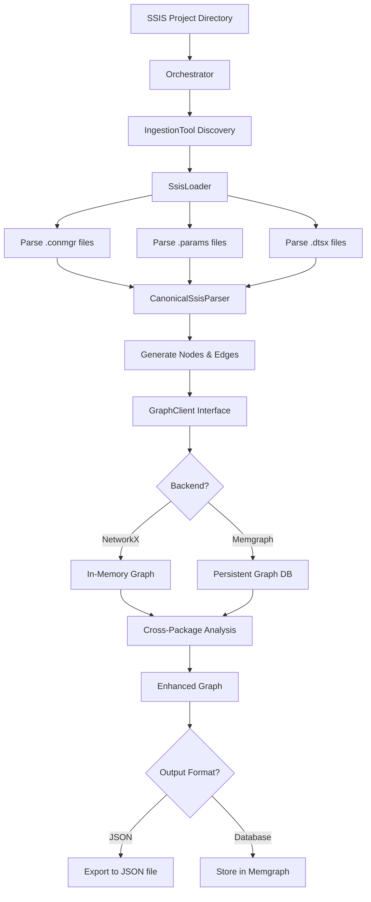

# MetaZCode Architecture Deep Dive

## Overview

You're absolutely correct! MetaZCode is a tool that takes SSIS (SQL Server Integration Services) packages, parses them, creates a graph representation from the extracted metadata and business logic, and outputs the results in either JSON format or to a graph database (Memgraph).

## How It Works - High Level Flow



## Detailed Architecture Breakdown

### 1. Entry Point - CLI Commands (`metazcode/cli/commands.py`)

The system provides several CLI commands:
- `ingest`: Parse SSIS packages and build initial graph
- `analyze`: Perform cross-package dependency analysis
- `full`/`complete`: Run both ingestion and analysis
- `dump`: Export graph to JSON
- `visualize`: Generate graph visualization

### 2. Orchestration Layer (`metazcode/cli/orchestrator.py`)

The `Orchestrator` class:
- Automatically discovers all `IngestionTool` subclasses using Python introspection
- Manages the ingestion pipeline execution
- Coordinates between different ingestion tools and the graph backend

### 3. Ingestion Framework

#### Base Class (`metazcode/sdk/ingestion/ingestion_tool.py`)
```python
class IngestionTool(ABC):
    def __init__(self, root_path: str):
        self.root_path = Path(root_path)
    
    def discover_files(self, file_pattern: str) -> List[Path]:
        return list(self.root_path.rglob(file_pattern))
    
    @abstractmethod
    def ingest(self) -> Generator[Tuple[List[Node], List[Edge]], None, None]:
        raise NotImplementedError
```

#### SSIS Loader (`metazcode/sdk/ingestion/ssis/ssis_loader.py`)
The `SsisLoader` class:
1. **Discovers SSIS files**: `.dtsx`, `.conmgr`, `.params`
2. **Parses connection managers** first to build context
3. **Parses project parameters** for parameter context
4. **Creates connection and parameter nodes** from parsed data
5. **Delegates to `CanonicalSsisParser`** for package parsing

### 4. SSIS Parser (`metazcode/sdk/ingestion/ssis/ssis_parser.py`)

The `CanonicalSsisParser` is the core parsing engine:

#### Key Features:
- Uses `lxml` for robust XML parsing
- Handles SSIS namespace mappings
- Extracts business logic from various task types
- Supports SQL semantic analysis for migration readiness
- Creates canonical node and edge representations

#### Parsing Flow:
1. **Package Level**: Creates `PIPELINE` node for each .dtsx file
2. **Connection Managers**: Extracts connection details, parameterized connections
3. **Parameters & Variables**: Captures configuration elements
4. **Tasks/Operations**: 
   - SQL Tasks → extracts queries, analyzes semantics
   - Data Flow Tasks → captures transformations, source/target mappings
   - Script Tasks → preserves code snippets
   - Control Flow → maintains execution dependencies

### 5. Graph Data Model

#### Node Types (`metazcode/sdk/models/canonical_types.py`)
- `PIPELINE`: SSIS packages
- `OPERATION`: Tasks within packages
- `DATA_ASSET`: Tables, files, datasets
- `CONNECTION`: Database connections
- `PARAMETER`: Configuration parameters
- `VARIABLE`: Package variables
- `TRANSFORMATION`: Data transformations

#### Edge Types
- `CONTAINS`: Parent-child relationships
- `READS_FROM`/`WRITES_TO`: Data flow
- `USES_CONNECTION`: Connection usage
- `DEPENDS_ON`: Cross-package dependencies
- `JOINS_WITH`: SQL join relationships

### 6. Graph Backend Abstraction

#### Interface (`metazcode/sdk/graph/graph_client_interface.py`)
```python
class GraphClientInterface(ABC):
    @abstractmethod
    def write_node(self, node: Node): pass
    @abstractmethod
    def write_edge(self, edge: Edge): pass
    @abstractmethod
    def get_node(self, node_id: str): pass
    @abstractmethod
    def get_graph(self): pass
```

#### Implementations:

**NetworkX Backend** (`client_nx.py`):
- In-memory graph using NetworkX
- Fast for small/medium projects
- No persistence between runs
- Full graph algorithm support

**Memgraph Backend** (`client_memgraph.py`):
- Persistent graph database
- Scalable for large enterprise projects
- Cypher query support
- Real-time graph analytics

### 7. Cross-Package Analysis (`metazcode/sdk/analysis/cross_package_analyzer.py`)

Analyzes the graph to identify:
1. **Shared Resources**:
   - Tables accessed by multiple packages
   - Shared connections
   - Common parameters

2. **Data Dependencies**:
   - Producer-consumer relationships
   - Data flow between packages
   - Execution order requirements

3. **Risk Analysis**:
   - Resource contention
   - Circular dependencies
   - Missing dependencies

### 8. Output Formats

#### JSON Export
- Uses NetworkX's `node_link_data` format
- Includes all node and edge properties
- Custom serialization for complex types
- Human-readable and tool-friendly

#### Memgraph Storage
- Direct storage in graph database
- Queryable via Cypher
- Supports real-time analytics
- Persistent across sessions

## Technical Implementation Details

### SQL Semantic Analysis
The parser includes advanced SQL parsing capabilities:
- Extracts table references from complex queries
- Identifies JOIN relationships
- Captures WHERE clause filters
- Preserves transformation logic

### Type Mapping System
- Maps SSIS data types to target platforms
- Supports multiple migration targets
- Configurable type conversion rules

### Error Handling
- Graceful handling of malformed XML
- Continues processing on individual file failures
- Comprehensive logging at all levels
- Detailed error reporting

### Performance Optimizations
- Lazy loading of large files
- Batch processing of nodes/edges
- Efficient graph algorithms
- Caching of parsed results

## Usage Examples

### Basic Ingestion
```bash
# Parse SSIS project and create graph
uv run python -m metazcode ingest --path /path/to/ssis/project
```

### Full Analysis with JSON Export
```bash
# Complete pipeline with cross-package analysis
uv run python -m metazcode full --path /path/to/ssis/project --output analysis.json
```

### Using Memgraph Backend
```bash
# Start Memgraph
docker-compose up -d

# Run with Memgraph backend
METAZCODE_DB_BACKEND=memgraph uv run python -m metazcode full --path /path/to/ssis/project
```

## Key Insights

1. **Plugin Architecture**: The ingestion framework is extensible - new data sources can be added by creating new `IngestionTool` subclasses

2. **Technology Agnostic**: The canonical model abstracts away SSIS-specific details, making it possible to support other ETL tools

3. **Migration Ready**: The semantic analysis and type mapping prepare the extracted metadata for automated migration

4. **Enterprise Scale**: The Memgraph backend option enables analysis of massive SSIS deployments with thousands of packages

5. **AI Integration**: The rich metadata extraction enables AI-powered migration planning and code generation